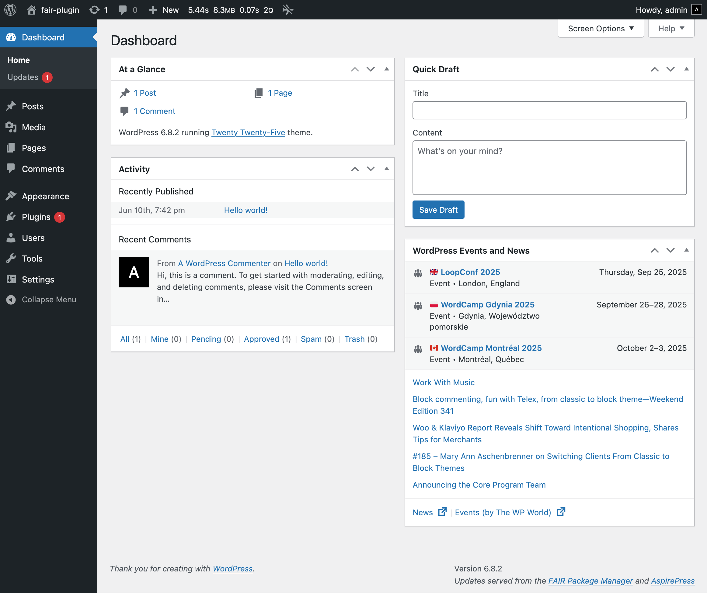
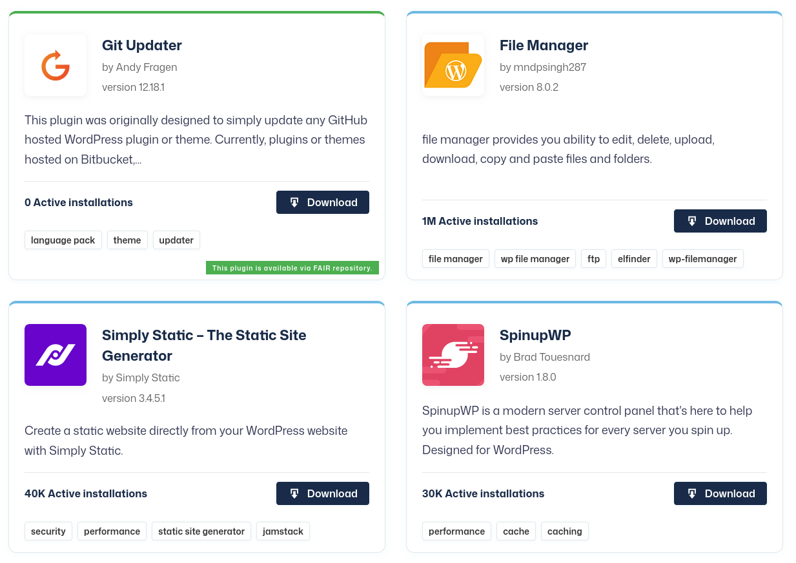
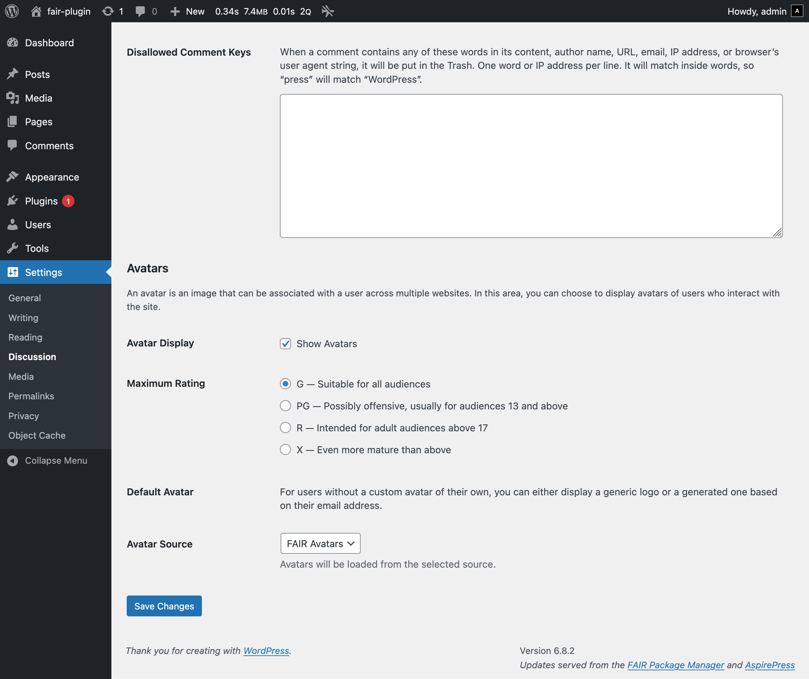
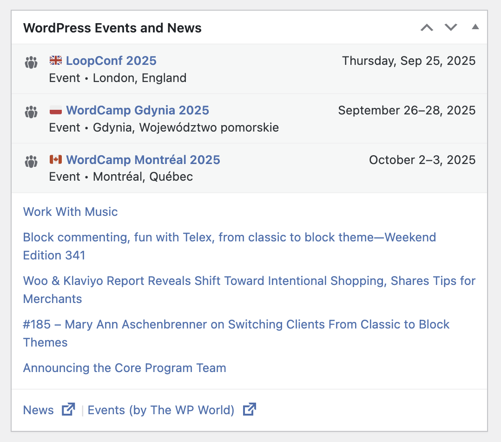
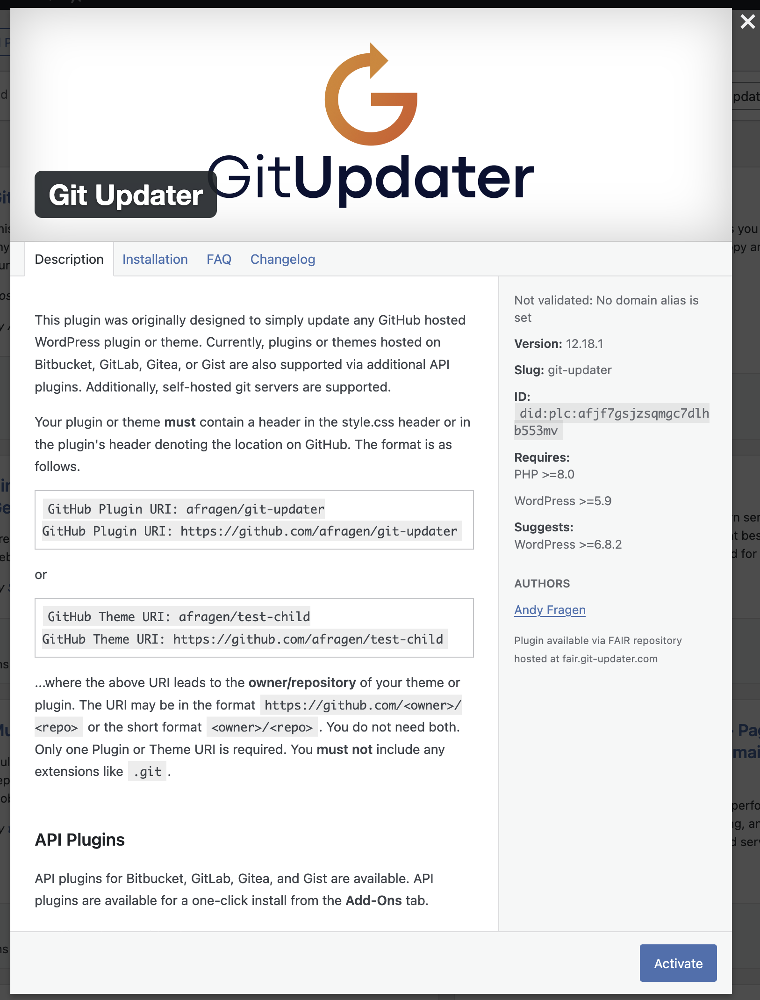

**Decentralised WordPress packages are here**. The working group for Federated And Independent Repositories (FAIR) is excited to announce its **1.0 Milestone Release**. This milestone includes updates to several of the software projects that FAIR maintains, enabling WordPress site administrators to **find**, **trust**, and **install** packages from **independent sources** or from a mirror of the official WordPress repository. With this milestone, FAIR invites any WordPress site owner or maintainer to install FAIR’s technical independence plugin to access this combined set of packages.

*Lower right corner displays updates source.*

## Overview

FAIR enables you to run a small, trusted plugin hub that you control. Your site can install plugins from [WordPress.org](https://wordpress.org) and from independent FAIR sources. Each package is verified with cryptographic signatures and identified with a [DID](https://www.w3.org/TR/did-1.1/) (Decentralized Identifier).

Browse packages at [fair.pm/packages](https://fair.pm/packages), or directly from the plugin search screen after installing the [FAIR Plugin](https://github.com/fairpm/fair-plugin/releases).

Results are powered by **AspireCloud**, which combines WordPress.org plugins with FAIR-registered independent sources. When you choose a FAIR-registered plugin, its cryptographic signature is checked before installation, and updates from these sources work as smoothly as updates for official WordPress plugins.

## New in this release

As this release combines progress across many different parts of the FAIR project, we’ll include the main changes for each of its projects.

## AspireCloud

AspireCloud aggregates metadata for packages from multiple sources and presents them as a combined list that you can browse, select, and install using the link provided by AspireCloud for each package. This release adds selected plugins from independent repositories to its index, making it more than a mirror, but a gateway to a decentralized group of software sources. The release includes search performance improvements with a new API to support faceted searches.

## AspireExplorer

AspireExplorer is a WordPress plugin that provides a public web interface for browsing and downloading packages. The plugin now also powers the listings at [fair.pm/packages/](https://fair.pm/packages/), where you can browse or search the AspireCloud index. The FAIR Plugin itself can be [downloaded from this listing](https://fair.pm/packages/plugins/fair-plugin/). These listings include a badge indicating packages that come from FAIR sources instead of WordPress.org.

## FAIR 1.0 plugin

The FAIR plugin enables your site to install and update plugins and themes from the FAIR network while minimizing data sharing to support GDPR and other privacy regulations.

- Manages plugin & theme installation and updates

– Installs & updates both WordPress.org and FAIR-registered software   – Performs [ED25519 signature verification](https://en.wikipedia.org/wiki/EdDSA) on FAIR software packages for security

- Increases privacy for regional requirements (EU and elsewhere)

– Limits contact to third-party servers   – Does not store or report personally identifiable information

- Increases Performance

– Uses local metadata when possible   – Performs many functions internally rather than via third-party services   – Avoids pings to unpublished content

In short, the FAIR plugin supports decentralized, verifiable sources, allowing site owners to maintain control over where data is sent and how plugins are installed. These updates help ensure that plugin discovery, installation, and updates work smoothly and securely across both official and independent sources just as easily as you’ve always done from your WordPress dashboard.

*Avatar Source selection can be toggled at Settings > Discussion > Avatars*

## Mini-FAIR Repo plugin

FAIR has created a WordPress plugin that turns your site into a FAIR-ready connector for advertising your plugin or theme published on GitHub, Gitea, GitLab, or Bitbucket. This release enables serving listings of published packages to the FAIR network using DIDs and REST API endpoints.

## Planet FAIR

Planet FAIR is the component that serves the news in the FAIR ecosystem. It is a curated feed shown in the WordPress admin dashboard and also lists upcoming events in the WordPress ecosystem. This release addresses RSS publishing issues and enhances source curation. Guidelines for inclusion are available in the Planet repository: [FAIR’s Planet repository](https://github.com/fairpm/planet/blob/main/guidelines.md).

## Why FAIR 1.0 matters

FAIR 1.0 is the first time the full stack works together. For users, this means you can now discover and install plugins from outside the WordPress.org ecosystem without needing to modify your workflow. For developers and publishers, it offers a real, working path to distribute trusted software independently, using open standards and shared infrastructure.

This release brings together everything FAIR stands for. It gives site owners more control over where their software comes from. It allows plugin authors to publish without relying on centralized platforms. And it provides the entire ecosystem with a model that makes decentralization feel familiar, secure, and easy to use.

With cryptographic signing, DNS-based identity, open metadata, and support for community-led moderation, this milestone lays the foundation for a future where package distribution is both decentralized and verifiable.

Most importantly, it shows that FAIR is not just a proposal or a protocol. It is a working ecosystem, and it is ready for others to build on.

## Acknowledgements

Thank you to everyone who contributed to FAIR 1.0!

Andrew Norcross, Andy Fragen, Anonymous, Austin, Benjamin Sternthal, Brent Toderash, Carrie Dils, Chris Reynolds, Chuck Adams, Claudio Rimann, Colin Stewart, Cory Curtis, Courtney Robertson, Cristi Rusu, Jason Cosper, Joe Dolson, Joe Hoyle, Joe Murray, Joost de Valk, Jory Burson, Joshua Eichorn, Karim Marucchi, Kevin Cristiano, Marc Armengou, Matt Leach, Mika Epstein, Najm Njeim, Namith Jawahar, Pat Ramsey, Peter Wilson, philipjohn, Ryan McCue, Sarah Savage, Scott Kingsley Clark, Sé Reed, Shady Sharaf, Siobhan McKeown, Taco Verdonschot, Timi Wahalahti, Topher DeRosia, and Veerle Verbert

*If your name is missing here, please let us know either [on GitHub](https://github.com/fairpm/website-content/issues) or in the [FAIR Chat](https://chat.fair.pm)!*

## Try FAIR 1.0 today

Ready to explore FAIR?

- Install the FAIR Plugin to search for verified plugins from both official and independent sources.
- Browse packages at fair.pm/packages
- Publish your own plugin using Mini-FAIR
- Find us on GitHub as FAIR PM
- Join the conversation by getting involved in our Slack or GitHub Discussions

If you’re a developer, publisher, or simply curious, we’d love to hear your thoughts.
